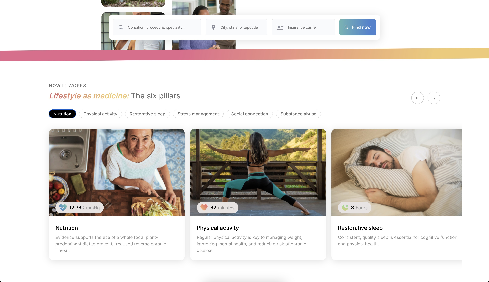

# ProVital Task Submission

This project was bootstrapped with [Create React App](https://github.com/facebook/create-react-app).

## Available Scripts

In the project directory, you can run:

### `npm start`

Runs the app in the development mode.\
Open [http://localhost:3000](http://localhost:3000) to view it in your browser.

The page will reload when you make changes.\
You may also see any lint errors in the console.

## About Project

### Deployed Link

The project is deployed on Firebase. You can view it [here](https://provitalportfolio.web.app/).

### Project Images

